# ☁️ AWS EC2 Log Automation & S3 Archival Project

A hands-on AWS project that automates the collection, monitoring, processing, and archival of EC2 server/application logs using Amazon CloudWatch, AWS Lambda, Amazon S3, AWS IAM, and Amazon EventBridge.

## 📌 Project Overview

This project demonstrates how logs generated on an Amazon EC2 instance can be collected using the Amazon CloudWatch Agent, delivered to CloudWatch Logs, and archived in Amazon S3.

The workflow combines CloudWatch log collection with serverless automation using AWS Lambda and EventBridge. Amazon S3 is used as the centralized destination for log archival.

## 🏗️ Architecture

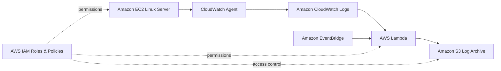

### Data Flow

```text
EC2 Instance
     │
     ▼
CloudWatch Agent
     │
     ▼
CloudWatch Logs
     │
     ▼
AWS Lambda ◄──── EventBridge
     │
     ▼
Amazon S3
```

## 🚀 AWS Services Used

| AWS Service | Purpose |
|---|---|
| Amazon EC2 | Source server generating logs |
| Amazon CloudWatch Agent | Collects log files from EC2 |
| Amazon CloudWatch Logs | Centralized log collection and monitoring |
| AWS Lambda | Serverless log-processing and automation |
| Amazon S3 | Centralized log archive |
| AWS IAM | Roles and permissions for AWS services |
| Amazon EventBridge | Scheduled automation trigger |

## 🔑 Key Concepts Practiced

- EC2 log collection
- CloudWatch Agent installation and configuration
- CloudWatch Log Groups and Log Streams
- Lambda automation with Python/Boto3
- Amazon S3 log archival
- IAM roles and permissions
- EventBridge scheduled rules
- Serverless architecture
- Event-driven automation
- CloudWatch Logs export to S3
- Troubleshooting a multi-service AWS workflow

## 📂 Repository Structure

```text
AWS-EC2-Log-Automation-and-S3-Archival-Project/
│
├── README.md
├── architecture/
│   └── architecture.md
├── cloudwatch/
│   └── cloudwatch-agent-config.json
├── eventbridge/
│   └── eventbridge-schedule.md
├── iam/
│   └── iam-permissions.md
├── lambda/
│   └── log_automation.py
├── s3/
│   └── s3-configuration.md
├── docs/
│   └── screenshots/
│       ├── ec2-instance.jpg
│       ├── cloudwatch-agent.jpg
│       ├── cloudwatch-log-group.jpg
│       ├── cloudwatch-log-stream.jpg
│       ├── lambda-test.jpg
│       ├── eventbridge-rule.jpg
│       ├── s3-bucket-policy.jpg
│       ├── logs-uploaded-to-s3.jpg
│       ├── logs-updated-to-s3-from-lambda.jpg
│       ├── log-file-inside-s3.jpg
│       └── logs-downloaded-from-s3.jpg
└── .gitignore
```

# 🛠️ Implementation Steps

## 1. Create the EC2 Instance

Launch an Amazon Linux EC2 instance and use it as the source server for the project.

Install and configure the application/server whose logs you want to collect.

Example log location:

```text
/var/log/messages
```

For this project, the CloudWatch Agent configuration collects log files from:

```text
/var/log/*
```

Use the actual log path required by your application when configuring the CloudWatch Agent.

---

## 2. Create and Attach the IAM Role

The EC2 instance needs an IAM role so that the CloudWatch Agent can send log data to Amazon CloudWatch.

### Steps

1. Open the **AWS IAM Console**.
2. Go to **Roles → Create role**.
3. Select **AWS Service** as the trusted entity.
4. Select **EC2** as the use case.
5. Attach the managed policy:

```text
CloudWatchAgentServerPolicy
```

6. Give the role a meaningful name, for example:

```text
customs-CloudWatchFullAccessRole
```

7. Create the role.
8. Open the **EC2 Console**.
9. Select the EC2 instance.
10. Choose **Actions → Security → Modify IAM Role**.
11. Select the IAM role you created.
12. Click **Update IAM Role**.

---

## 3. Install the CloudWatch Agent

Connect to the EC2 instance and install the Amazon CloudWatch Agent.

Run:

```bash
yum install amazon-cloudwatch-agent -y
```

Create the CloudWatch Agent configuration file:

```bash
vi /opt/aws/amazon-cloudwatch-agent/bin/config.json
```

Add the following configuration to collect the EC2 log files:

```json
{
  "logs": {
    "logs_collected": {
      "files": {
        "collect_list": [
          {
            "file_path": "/var/log/*",
            "log_group_name": "ec2-all-logs",
            "log_stream_name": "{instance_id}-all-logs"
          }
        ]
      }
    }
  }
}
```

Start the CloudWatch Agent using the configuration:

```bash
/opt/aws/amazon-cloudwatch-agent/bin/amazon-cloudwatch-agent-ctl -a fetch-config -m ec2 -c file:/opt/aws/amazon-cloudwatch-agent/bin/config.json -s
```

Enable the agent to start automatically after a reboot:

```bash
systemctl enable amazon-cloudwatch-agent
```

---

## 4. Verify Logs in CloudWatch

After starting the CloudWatch Agent:

1. Open the **Amazon CloudWatch Console**.
2. Navigate to **Logs → Log Groups**.
3. Open the configured log group:

```text
/ec2-all-logs
```

4. Open the corresponding log stream.
5. Verify that log events are being received from the EC2 instance.

---

## 5. Generate Application Logs (Optional)

To generate additional application/server logs, install Apache HTTP Server:

```bash
yum install httpd -y
```

Start the service if required:

```bash
systemctl start httpd
```

The generated application/server logs can then be collected by the CloudWatch Agent and viewed in CloudWatch Logs.

---

## 6. Create the S3 Bucket

Create an Amazon S3 bucket to store the exported/archived logs.

### Steps

1. Open the **Amazon S3 Console**.
2. Click **Create bucket**.
3. Enter a globally unique bucket name.
4. Keep the bucket private.
5. Keep **Block Public Access** enabled unless your specific use case requires otherwise.
6. Create the bucket.

Example placeholder:

```text
my-ec2-log-archive-bucket
```

---

## 7. Configure the S3 Bucket Policy

For the **CloudWatch Logs → S3 export** workflow, open the S3 bucket and configure its bucket policy.

### Steps

1. Open the S3 bucket.
2. Go to the **Permissions** tab.
3. Find **Bucket policy**.
4. Click **Edit**.
5. Add the following policy.

Replace:

```text
(S3-bucket-name)
```

with your actual S3 bucket name.

```json
{
  "Version": "2012-10-17",
  "Statement": [
    {
      "Sid": "AllowCloudWatchLogs",
      "Effect": "Allow",
      "Principal": {
        "Service": "logs.amazonaws.com"
      },
      "Action": [
        "s3:PutObject",
        "s3:GetBucketAcl",
        "s3:GetObject"
      ],
      "Resource": [
        "arn:aws:s3:::(S3-bucket-name)/*",
        "arn:aws:s3:::(S3-bucket-name)"
      ]
    }
  ]
}
```

6. Click **Save Changes**.

> **Important:** The policy above is for the CloudWatch Logs → S3 export workflow. If your Lambda function writes objects directly to S3, the Lambda execution role also needs the appropriate S3 permissions for the Lambda-based upload path.

---

## 8. Export CloudWatch Logs to S3

After configuring the bucket policy:

1. Open **Amazon CloudWatch**.
2. Navigate to **Logs → Log Groups**.
3. Select the log group you want to export.
4. Choose **Actions → Export data to Amazon S3**.
5. Select your S3 bucket.
6. Start the export.

---

## 9. Verify Logs in S3

Open the S3 bucket and check the destination location.

CloudWatch exported logs can appear as compressed `.gz` files.

Example:

```text
S3 Bucket
└── Exported CloudWatch Logs
    └── *.gz
```

---

## 10. Configure AWS Lambda

Create an AWS Lambda function for the serverless log automation workflow.

The Lambda source code for this project is located at:

```text
lambda/log_automation.py
```

The function can automate log-processing/archive operations and write the resulting objects to Amazon S3.

Make sure the Lambda execution role has only the permissions required for the resources used by the function.

Do not place AWS access keys or secret keys inside the Lambda source code.

---

## 11. Configure Amazon EventBridge

Create an EventBridge scheduled rule to trigger the Lambda function.

Example schedule:

```text
rate(5 minutes)
```

Use a schedule appropriate for your log volume and project requirements.

Configuration notes are available in:

```text
eventbridge/eventbridge-schedule.md
```

---

## 12. Test the Complete Workflow

Generate new log activity on the EC2 instance and verify the complete workflow:

```text
EC2
 ↓
CloudWatch Agent
 ↓
CloudWatch Logs
 ↓
Lambda / CloudWatch Logs Export
 ↓
Amazon S3
```

Verify:

- CloudWatch receives the EC2 logs.
- Lambda executes successfully when triggered.
- CloudWatch Logs export works when used.
- S3 receives the expected log archive files.
- Downloaded log files contain the expected data.

# 📊 Validation Checklist

- [ ] EC2 instance is running
- [ ] IAM role is attached to EC2
- [ ] `CloudWatchAgentServerPolicy` is attached
- [ ] CloudWatch Agent is installed
- [ ] CloudWatch Agent configuration is valid
- [ ] CloudWatch Agent is running
- [ ] CloudWatch Log Group receives events
- [ ] CloudWatch Log Stream receives events
- [ ] S3 bucket is created
- [ ] S3 bucket policy is configured for CloudWatch Logs export when required
- [ ] Lambda function is configured
- [ ] Lambda execution role has required permissions
- [ ] EventBridge rule is configured
- [ ] Logs are successfully archived in S3
- [ ] Exported/downloaded log files can be verified

# 🔐 Security Considerations

- Never commit AWS access keys or secret keys.
- Prefer IAM roles instead of long-lived credentials.
- Keep the S3 bucket private.
- Keep S3 Block Public Access enabled unless explicitly required.
- Enable S3 encryption.
- Follow least-privilege IAM permissions.
- Restrict EC2 security-group rules to required traffic only.
- Replace all placeholder bucket names with your own values.
- Sanitize screenshots before publishing them publicly.
- Do not publish AWS account IDs, private IP addresses, secrets, tokens, or sensitive log contents.

# 📸 Project Screenshots

The repository contains screenshots demonstrating the project implementation and validation.

### 1. EC2 Instance

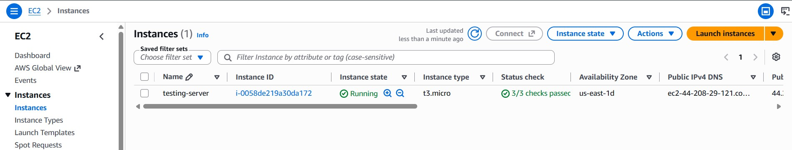

### 2. CloudWatch Agent

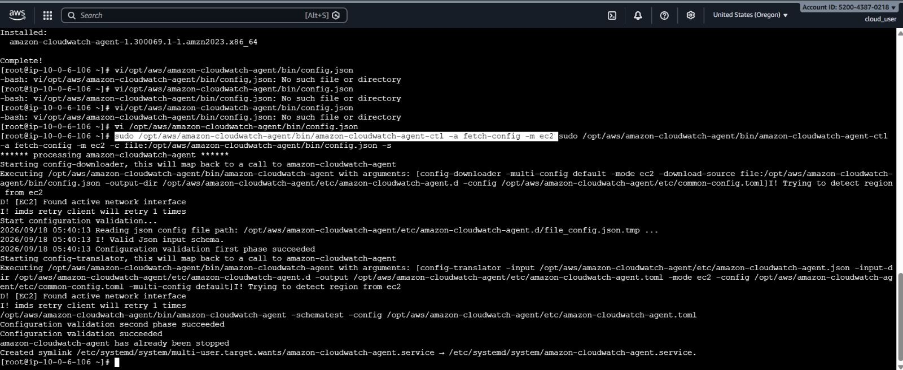

### 3. CloudWatch Log Group

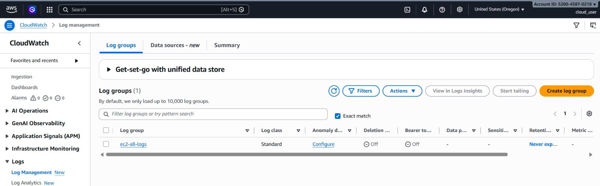

### 4. CloudWatch Log Stream

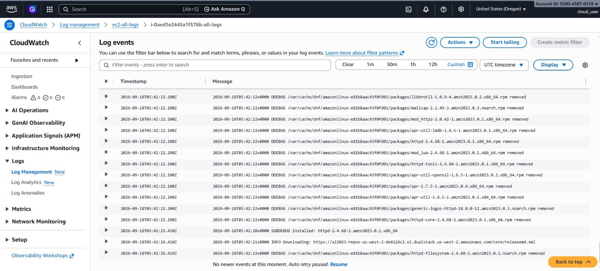

### 5. Lambda Test

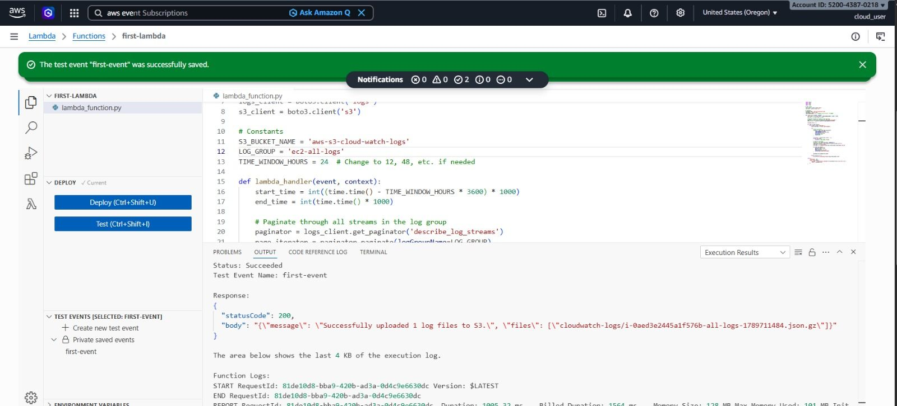

### 6. EventBridge Rule

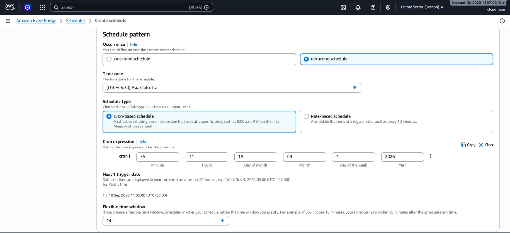

### 7. S3 Bucket Policy

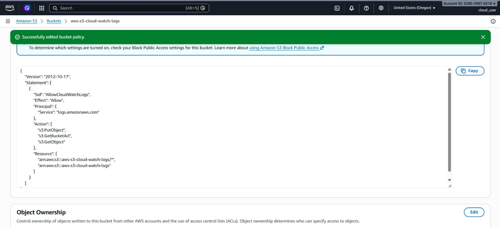

### 8. Logs Uploaded to S3

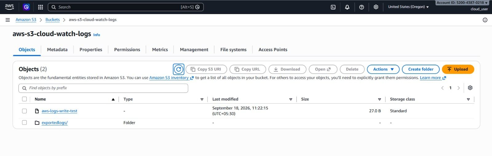

### 9. Logs Updated to S3 from Lambda

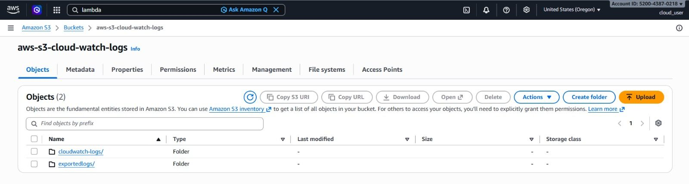

### 10. Log File Inside S3

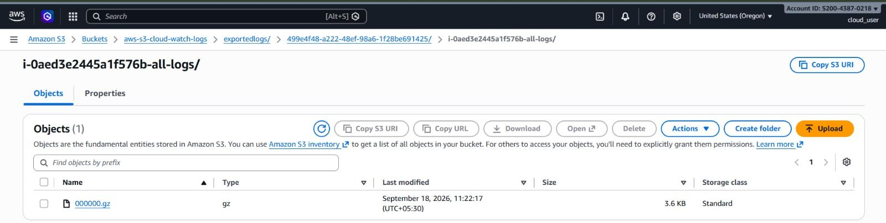

### 11. Logs Downloaded from S3

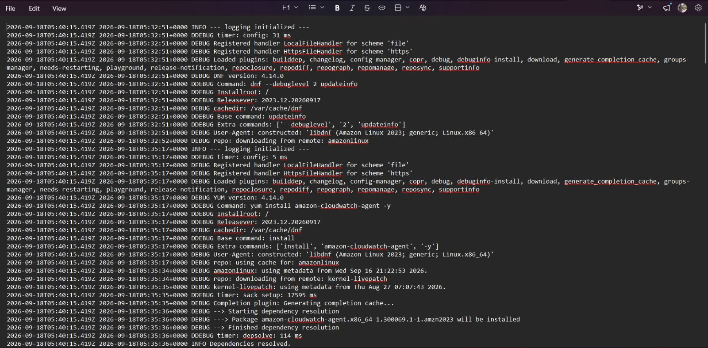

# 🧠 What I Learned

- How to create and attach IAM roles to EC2.
- How to install and configure the Amazon CloudWatch Agent.
- How EC2 log files can be collected into CloudWatch Logs.
- How to verify CloudWatch Log Groups and Log Streams.
- How to create an S3 bucket for log archival.
- How CloudWatch Logs can export log data to S3.
- How S3 bucket policies control service access.
- How Lambda can automate cloud operations using Python and Boto3.
- How EventBridge can trigger serverless automation on a schedule.
- How to troubleshoot a multi-service AWS workflow from EC2 to CloudWatch to S3.

# 🎯 Project Outcome

The completed project demonstrates a practical AWS workflow for collecting EC2 logs, monitoring them through CloudWatch, automating log-processing/archive operations with serverless services, and storing logs in Amazon S3.

The repository also provides step-by-step instructions, configuration examples, and screenshots so the project can be reproduced in an AWS learning environment.

# ⚠️ Important

This repository is intended for learning and demonstration purposes.

Before using the configuration in a production environment:

- Review IAM permissions.
- Replace all placeholder values.
- Review S3 bucket security settings.
- Configure the correct EC2 log paths.
- Review Lambda permissions and code.
- Follow your organization's security and retention requirements.

# 👨‍💻 Author

**Venkata Subbarao**

- GitHub: [VENKATASUBBARAO13](https://github.com/VENKATASUBBARAO13)
- LinkedIn: [Venkata Subbarao](https://www.linkedin.com/in/ventrapragada-venkata-subbarao)
- Portfolio: [Portfolio](https://venkata-subbarao-portfolio.vercel.app)

---

⭐ If this project helps you understand AWS EC2 log automation, CloudWatch, Lambda, EventBridge, and S3, feel free to explore the repository and build your own version.
