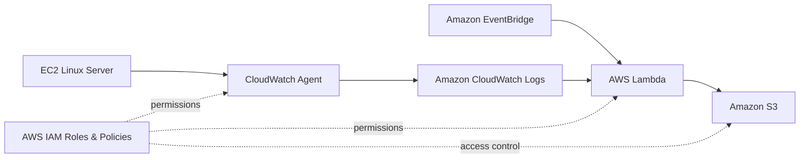

# ☁️ AWS Serverless Log Automation Pipeline

A hands-on AWS serverless project that automates the collection, processing, and centralized storage of EC2 application/server logs using Amazon CloudWatch Logs, AWS Lambda, Amazon S3, AWS IAM, and Amazon EventBridge.

## 📌 Project Overview

This project demonstrates how server logs generated on an Amazon EC2 instance can be collected by the CloudWatch Agent, made available through CloudWatch Logs, processed by a serverless AWS Lambda function, and archived into an Amazon S3 bucket.

The project focuses on building a simple, event-driven and serverless log automation workflow without maintaining a dedicated log-processing server.

## 🏗️ Architecture



### Data Flow

```text
EC2 Instance
     │
     ▼
CloudWatch Agent
     │
     ▼
CloudWatch Logs
     │
     ├──────────────┐
     │              │
     ▼              ▼
EventBridge ───► Lambda
                    │
                    ▼
                Amazon S3
```

## 🚀 AWS Services Used

| Service | Purpose |
|---|---|
| Amazon EC2 | Source server generating logs |
| CloudWatch Agent | Collects logs from EC2 |
| CloudWatch Logs | Centralized log destination |
| AWS Lambda | Serverless log-processing automation |
| Amazon S3 | Durable log archive |
| AWS IAM | Secure permissions and service access |
| Amazon EventBridge | Scheduled Lambda automation |

## 🔑 Key Concepts Practiced

- EC2 log collection
- CloudWatch Agent configuration
- CloudWatch Logs
- Lambda with Python and Boto3
- S3 object storage
- IAM roles and least-privilege permissions
- EventBridge scheduled automation
- Serverless architecture
- Event-driven automation
- Log archival and centralized storage

## 📂 Repository Structure

```text
AWS-Serverless-Log-Automation-Pipeline-Project/
│
├── README.md
│
├── architecture/
│   └── architecture.md
│
├── lambda/
│   └── log_automation.py
│
├── cloudwatch/
│   └── cloudwatch-agent-config.json
│
├── iam/
│   └── iam-permissions.md
│
├── eventbridge/
│   └── eventbridge-schedule.md
│
├── s3/
│   └── s3-configuration.md
│
├── docs/
│   └── screenshots/
│       └── .gitkeep
│
└── .gitignore
```

## 🛠️ Implementation Steps

### 1. Create the EC2 Instance

Launch an Amazon Linux EC2 instance and use it as the source server for the project.

Install and configure the application/server whose logs you want to monitor.

Example log location:

```text
/var/log/messages
```

Use the actual log path for your application when configuring the CloudWatch Agent.

### 2. Configure the CloudWatch Agent

Install the Amazon CloudWatch Agent on the EC2 instance and configure it to collect the required log files.

The example configuration is available at:

```text
cloudwatch/cloudwatch-agent-config.json
```

The configuration should send the selected EC2 log files to a CloudWatch Log Group.

### 3. Verify CloudWatch Logs

After starting the CloudWatch Agent:

1. Open Amazon CloudWatch.
2. Navigate to **Logs → Log groups**.
3. Open the configured log group.
4. Verify that log streams are receiving events.

### 4. Create the S3 Bucket

Create a private S3 bucket for centralized log archival.

Recommended approach:

- Keep Block Public Access enabled.
- Enable server-side encryption.
- Use a dedicated prefix such as `ec2-logs/`.
- Do not place AWS credentials in the repository.

See `s3/s3-configuration.md` for the project notes.

### 5. Configure IAM

Create an IAM execution role for Lambda with only the permissions required to read the CloudWatch log data and write the generated archive to S3.

The permission guidance is documented in:

```text
iam/iam-permissions.md
```

Avoid using long-lived access keys inside Lambda code.

### 6. Create the Lambda Function

Create a Python Lambda function and use the code in:

```text
lambda/log_automation.py
```

The function demonstrates the core automation pattern using Boto3.

Update the configuration values for your own AWS environment before deploying.

### 7. Configure EventBridge

Create an EventBridge scheduled rule to invoke the Lambda function periodically.

Example schedule:

```text
rate(5 minutes)
```

For production, select a schedule appropriate for your log volume and operational requirements.

See:

```text
eventbridge/eventbridge-schedule.md
```

### 8. Test the Pipeline

Generate new log activity on the EC2 instance and verify the complete flow:

```text
EC2
 ↓
CloudWatch Agent
 ↓
CloudWatch Logs
 ↓
Lambda
 ↓
S3
```

Check the Lambda execution logs in CloudWatch and confirm that the expected log archive object appears in S3.

## 📊 Validation Checklist

- [ ] EC2 instance is running
- [ ] CloudWatch Agent is installed
- [ ] CloudWatch Agent configuration is valid
- [ ] CloudWatch Log Group receives events
- [ ] S3 bucket is private and accessible by the Lambda role
- [ ] Lambda function executes successfully
- [ ] EventBridge invokes Lambda
- [ ] Lambda logs show successful processing
- [ ] Logs are present in the S3 destination

## 🔐 Security Considerations

- Never commit AWS access keys or secret keys.
- Prefer IAM roles instead of long-lived credentials.
- Keep the S3 bucket private.
- Enable S3 encryption.
- Follow least-privilege IAM permissions.
- Restrict EC2 security-group rules to required traffic only.
- Sanitize screenshots before publishing them publicly.
- Do not publish AWS account IDs, private IPs, secrets, tokens, or sensitive log contents.

## 📸 Project Screenshots

Add your project screenshots under:

```text
docs/screenshots/
```

Suggested screenshots:

1. EC2 instance running
2. CloudWatch Agent configuration
3. CloudWatch Log Group
4. CloudWatch log stream
5. Lambda function
6. Lambda execution/result
7. IAM Lambda role
8. EventBridge scheduled rule
9. S3 bucket
10. Logs successfully stored in S3

## 🧠 What I Learned

- How EC2 servers can send log data to CloudWatch Logs.
- How the CloudWatch Agent is configured for log collection.
- How Lambda can automate cloud operations using Python and Boto3.
- How S3 can be used as a centralized and durable log archive.
- How IAM controls access between AWS services.
- How EventBridge can trigger serverless automation on a schedule.
- How to troubleshoot a multi-service AWS workflow from source logs to final storage.

## 🎯 Project Outcome

The completed workflow provides an automated serverless approach for moving EC2 log data into S3 for centralized archival and further analysis.

This project was built as a hands-on AWS learning project to understand practical cloud monitoring, serverless automation, IAM, and object-storage workflows.

## ⚠️ Important

This repository contains example configurations and learning material. Replace placeholders such as AWS Region, CloudWatch Log Group, S3 bucket name, and log paths with values from your own environment.

Do not copy production IAM permissions without reviewing them for your environment.

## 👨‍💻 Author

**Venkata Subbarao**

- GitHub: [VENKATASUBBARAO13](https://github.com/VENKATASUBBARAO13)
- LinkedIn: [Venkata Subbarao](https://www.linkedin.com/in/ventrapragada-venkata-subbarao)
- Portfolio: [Portfolio](https://venkata-subbarao-portfolio.vercel.app)

---

⭐ If this project helps you understand AWS serverless log automation, feel free to explore the repository and build your own version.
